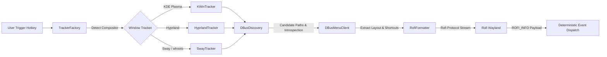

<div align="center">

# ⚡ rofi-wayland-hud

**Instant-trigger, Universal Global Menu HUD for Wayland compositors powered by Rofi**

[](https://en.wikipedia.org/wiki/C%2B%2B20)
[](https://wayland.freedesktop.org/)
[](https://kde.org/plasma-desktop/)
[](https://hyprland.org/)
[](https://swaywm.org/)
[](LICENSE)
[](https://github.com/sayoridev/rofi-wayland-hud/actions)

<br/>

```text
╭─────────────────────────────────────────────────────────────────────────────╮
│ HUD [Dolphin]                                                               │
├─────────────────────────────────────────────────────────────────────────────┤
│ 📁 File > New Tab                                           (Ctrl+Shift+T)  │
│ 📄 File > Create New > Text File...                                         │
│ 🔍 Edit > Find...                                           (Ctrl+F)        │
│ 🖨️  File > Print...                                          (Ctrl+P)        │
│ ⚙️  Settings > Configure Dolphin...                          (Ctrl+Shift+,)  │
│ ❓ Help > About Dolphin                                                     │
╰─────────────────────────────────────────────────────────────────────────────╯
```

</div>

---

## ✨ Overview

`rofi-wayland-hud` brings macOS / Unity style **Heads-Up Display (HUD) Global Menu searching** to modern Wayland desktops. 

Press a shortcut to bring up a fuzzy-searchable list of all menu bar actions for the currently active window, preview their keyboard shortcuts, and execute them instantly.

---

## 🚀 Key Features

- ⚡ **Zero-Interaction Window Detection**  
  Detects the active window and process automatically on launch without requiring mouse clicks or crosshair selection.
- 🖥️ **Multi-Compositor Strategy Pattern**  
  Polymorphic trackers automatically detect your compositor at runtime:
  - **KDE Plasma 6** (via `kdotool`)
  - **Hyprland** (via `hyprctl activewindow -j`)
  - **Sway / wlroots** (via `swaymsg -t get_tree`)
- ⌨️ **Keyboard Shortcut Hints & Search**  
  Extracts native accelerator strings (e.g. `Ctrl+S`, `Alt+F4`, `Ctrl+Shift+P`) from D-Bus menus, shows them alongside menu actions, and indexes them in Rofi search metadata.
- 🎯 **Deterministic Focus Dispatch**  
  Encodes target D-Bus service and object paths into Rofi payloads (`service|path|id`), eliminating focus-switch race conditions during action execution.
- 🚄 **High-Performance C++20 Core**  
  Powered by `sdbus-c++` with dynamic `/MenuBar/*` introspection, process hierarchy traversal (resolving PPID for Electron / Chromium apps), and strict timeouts to prevent freezing.
- 🎨 **Clean Breadcrumb Hierarchy**  
  Formats nested submenus as intuitive breadcrumbs (e.g. `File > Export > PDF`) with application icons.

---

## 🏗️ Architecture



---

## 📊 Compatibility Matrix

| Compositor | Detection Method | Backend Tool | Status |
| :--- | :--- | :--- | :---: |
| **KDE Plasma 6** | `$XDG_CURRENT_DESKTOP` | `kdotool` |  Stable |
| **Hyprland** | `$HYPRLAND_INSTANCE_SIGNATURE` | `hyprctl` |  Stable |
| **Sway / wlroots** | `$SWAYSOCK` | `swaymsg` |  Stable |

---

## 📋 Dependencies

| Package | Purpose |
| :--- | :--- |
| **`rofi-wayland`** | Rofi with Wayland protocol support |
| **`sdbus-c++`** | Modern C++ D-Bus library |
| **`cmake`** & **`gcc`** (or `clang`) | Build system and C++20 compiler |
| **`kdotool`** | *(Optional)* For KDE Plasma 6 active window detection |

---

## 📦 Installation

### Arch Linux (PKGBUILD)

This repository includes an optimized `PKGBUILD`:

```bash
# Install dependencies
sudo pacman -S --needed base-devel cmake sdbus-cpp rofi-wayland
paru -S kdotool  # If on KDE Plasma

# Clone and install
git clone https://github.com/sayoridev/rofi-wayland-hud.git
cd rofi-wayland-hud
makepkg -si
```

### Fedora

```bash
sudo dnf install cmake gcc-c++ sdbus-c++-devel rofi
git clone https://github.com/sayoridev/rofi-wayland-hud.git
cd rofi-wayland-hud
cmake -B build -DCMAKE_BUILD_TYPE=Release
cmake --build build
sudo cmake --install build
```

### Ubuntu / Debian

```bash
sudo apt update
sudo apt install cmake build-essential libsdbus-c++-dev rofi
git clone https://github.com/sayoridev/rofi-wayland-hud.git
cd rofi-wayland-hud
cmake -B build -DCMAKE_BUILD_TYPE=Release
cmake --build build
sudo cmake --install build
```

---

## ⚙️ Compositor Setup & Shortcuts

### 1. Launcher Script (`~/launch_hud.sh`)

Create a script to ensure the required Wayland and D-Bus environment variables are passed properly:

```bash
#!/usr/bin/env bash

export XDG_RUNTIME_DIR="/run/user/$(id -u)"
export WAYLAND_DISPLAY="${WAYLAND_DISPLAY:-wayland-0}"
export DBUS_SESSION_BUS_ADDRESS="${DBUS_SESSION_BUS_ADDRESS:-unix:path=${XDG_RUNTIME_DIR}/bus}"

exec rofi \
  -modi "hud:rofi_wayland_hud" \
  -show hud \
  -show-icons \
  -theme-str 'window { width: 45em; }'
```

Make it executable:
```bash
chmod +x ~/launch_hud.sh
```

---

### 2. Binding the Shortcut

#### 🟦 KDE Plasma 6
1. Open **System Settings** > **Keyboard** > **Shortcuts**.
2. Click **Add New** > **Command**.
3. Set the command to: `/home/YOUR_USERNAME/launch_hud.sh`.
4. Assign your preferred shortcut (e.g. `Alt + Space` or `Super + Space`).

#### 🟨 Hyprland (`~/.config/hypr/hyprland.conf`)
```ini
bind = $mainMod, Space, exec, ~/launch_hud.sh
```

#### 🟩 Sway (`~/.config/sway/config`)
```ini
bindsym $mod+Space exec ~/launch_hud.sh
```

---

## 🧪 Manual Terminal Testing

Run directly from your terminal:

```bash
rofi \
  -modi "hud:rofi_wayland_hud" \
  -show hud \
  -show-icons \
  -theme-str 'window { width: 42em; }'
```

---

## 🛠️ Troubleshooting

> [!TIP]
> **No menu items appearing?**  
> Ensure the target application exports a D-Bus menu. For Qt apps, ensure `appmenu-gtk-module` or KDE global menu daemon (`kded6`) is running. For Chromium / Electron apps, enable Wayland flags: `--ozone-platform=wayland --enable-features=GlobalShortcutsPortal`.

> [!NOTE]
> **Rofi mode not found?**  
> If `rofi` cannot locate `rofi_wayland_hud` in your `PATH`, use the absolute path in `-modi`:  
> `rofi -modi "hud:$(which rofi_wayland_hud)" -show hud`

---

## 📄 License

Distributed under the **MIT License**. See [`LICENSE`](LICENSE) for details.